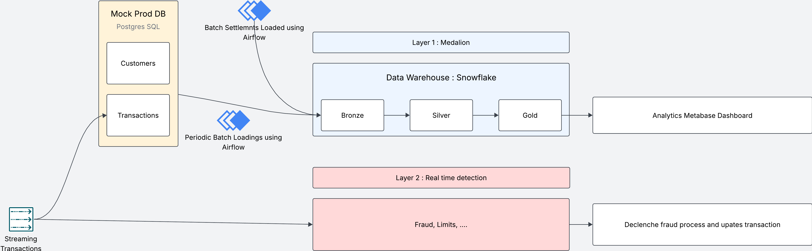

# Real-Time AML Lakehouse for Core Banking

## The Problem

In retail banking, when a customer taps their card or sends a transfer, the transaction is recorded instantly. But the official confirmation (the settlement) only arrives 1 to 3 days later from clearing networks (Visa, Mastercard, STET). If you build a compliance dashboard on settlements alone, it's accurate but days late. If you build it on live transactions alone, it's real-time but unreliable since transactions can get cancelled or blocked before they settle.

## The Solution

I designed and built a data platform that mimics a real-world banking system and tackles exactly this: use both sources, merge them, and serve live data today (labeled as pending) reconciled against confirmed data once settlements land.



## Input Data

The first important entity in any banking system is the customer. I generate 500 synthetic French customers using Faker (realistic names, addresses, IBANs) and load them once into the platform.

In the real world, transactions stream in continuously while settlements arrive in batches on a delay. I mimicked that: a Python producer streams transactions through Kafka (Redpanda, for easier local setup) into a Postgres database that acts as the bank's production system, and settlement Parquet files get generated from those same transactions on a 1-to-3-day delay, just like how clearing networks actually confirm them.

This is the E in the ELT pipeline the rest of the platform builds on.

## Layer 1: Streaming, Real-Time Fraud Detection

This layer is about catching fraud in seconds, not days.

When transactions come in, the Kafka consumer stores them in the Postgres prod database but also runs quick rule-based checks to decide if a transaction should be blocked. For example: if a HIGH-risk or PEP customer fires off 6+ `INSTANT_SEPA` transfers within ~40 minutes, the consumer flags and blocks it on the spot.

The detection is rule-based and deliberately so. AML regulation (ACPR/Tracfin) requires that detection logic be explainable and auditable. A regulator can ask exactly why a transaction was blocked, and "the model said so" isn't an acceptable answer. That said, this rule engine is exactly the kind of layer that could later be extended with an ML model or a gen AI agent, a good candidate for a follow-up project.

## Layer 2: Batch, Building the Analytics Warehouse

Now we need to use the data in the prod database for more general analytics and compliance dashboards. But it's not good practice to query the production Postgres directly (it would compete with live traffic) and the raw data still needs to be transformed and anonymized before anyone outside the platform team should see it.

So instead of reading from the prod database, we load the data into an analytical warehouse and transform it there. That's ELT: Load first, Transform inside the warehouse. Why not ETL? Because we're using Snowflake. Storage is cheap and compute is separate, so it makes more sense to load everything raw and transform it afterwards rather than transforming before loading and losing the raw history.

| Layer | What happens |
|---|---|
| **Bronze** | Raw data copied straight from Postgres and settlement Parquet files into Snowflake, untouched and replayable. If anything downstream changes, we replay from here without re-extracting. |
| **Silver (Staging)** | Cleaning: cast European-formatted amounts, derive cross-border flags from beneficiary IBANs, pseudonymize PII with HMAC-SHA256. |
| **Silver (Intermediate)** | Reconciliation: transactions and settlements joined via full outer join with status priority rules, so a blocked transaction stays blocked even after a settlement for it shows up. |
| **Gold** | Business-ready marts. `fct_transactions` enriched with customer risk tier. `fct_daily_aml_alerts` with rolling 30-day cross-border sums flagging the ACPR 10,000 EUR threshold. `snap_customers` as an SCD Type 2 snapshot tracking how risk tier or address changes over time, key when a regulator asks what we knew about a customer on a given date. |

This Gold layer is what Metabase reads from to build the compliance dashboard.

## Dashboarding

I built a dashboard with two views, one per layer, because the compliance team and the fraud-monitoring team are asking different questions:

- Total transactions processed, how many were flagged, and the overall fraud rate
- Customer base broken down by risk tier (LOW / MEDIUM / HIGH / PEP)
- Settlement reconciliation rate (SETTLED / PENDING / BLOCKED)
- Fraud breakdown by risk tier and by payment channel (instant SEPA, SEPA, card)
- AML regulatory alerts table: every triggered rule with masked sender IBAN, pseudonymized customer ID, risk tier, 30-day cross-border amount, and the exact rule code that fired (e.g. `CUMULATIVE_CROSS_BORDER_10K`)

The real-time tab reads straight from Postgres (live feed, blocked count, velocity alerts as they fire). The compliance tab reads from the Snowflake Gold layer, the audit-grade view.

## Orchestration

All of this is tied together by Airflow. A single batch DAG runs on a schedule: it loads customers, transactions, and settlements from the prod database into Snowflake Bronze, runs the dbt models from Bronze through Silver to Gold, and finally takes a snapshot for the SCD2 history.

## Industrialisation and Data Quality

Every component (Postgres, Airflow, the Kafka producer and consumer, Metabase) is containerized with Docker Compose, so the whole platform comes up with one command. Data quality is enforced with dbt tests, and the pipeline is checked in CI on every pull request with Ruff, mypy, and SQLFluff.

## Reflections

What makes this kind of project genuinely hard isn't any single component, it's making all the systems work together and stay resilient when one of them breaks. A small outage in one place shouldn't cascade into a full pipeline failure. Retries, idempotent loads, and database copies all have to be designed in deliberately, they don't happen by accident.

## Tech Stack

| Component | Technology |
|---|---|
| Language | Python 3.13, SQL |
| Streaming | Redpanda (Kafka API) |
| Operational DB | PostgreSQL 16 |
| Analytical warehouse | Snowflake |
| Transformation | dbt-core + dbt-snowflake |
| Orchestration | Apache Airflow |
| Dashboard | Metabase |
| Validation | Pydantic |
| Data quality | dbt tests |
| Containers | Docker Compose |
| CI/CD | GitHub Actions (Ruff, mypy, SQLFluff) |
| Package manager | uv |

## Setup

### 1. Snowflake

Create a free trial account, then run as `ACCOUNTADMIN`:

```sql
CREATE WAREHOUSE IF NOT EXISTS AML_WH
  WAREHOUSE_SIZE = 'XSMALL'
  AUTO_SUSPEND = 60
  AUTO_RESUME = TRUE;

CREATE DATABASE IF NOT EXISTS AML_LAKEHOUSE;

CREATE SCHEMA IF NOT EXISTS AML_LAKEHOUSE.BRONZE;
CREATE SCHEMA IF NOT EXISTS AML_LAKEHOUSE.SILVER;
CREATE SCHEMA IF NOT EXISTS AML_LAKEHOUSE.GOLD;

GRANT USAGE ON WAREHOUSE AML_WH TO ROLE SYSADMIN;
GRANT ALL ON DATABASE AML_LAKEHOUSE TO ROLE SYSADMIN;
```

### 2. Environment variables

Create a `.env` at the project root (gitignored):

```
SNOWFLAKE_ACCOUNT=your-account-id
SNOWFLAKE_USER=your-username
SNOWFLAKE_PASSWORD=your-password
```

These are read by `docker-compose.yml` (into Airflow and loader containers), by `dbt_banking/profiles.yml` via `env_var(...)`, and by the Python loaders in `loaders/`.

### 3. Run

```bash
docker compose up
```